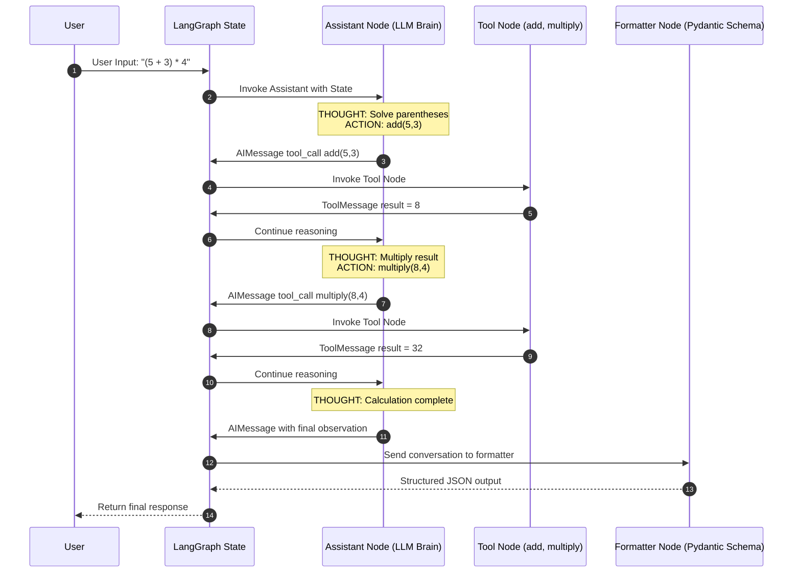

# BASIC-AGENTS

A collection of **basic LangGraph agents** designed to demonstrate core concepts and workflows such as:

- ReAct agents
- Tool usage
- Multi-step reasoning
- Structured outputs
- LangGraph state management

This project uses **`uv`** for fast dependency management and virtual environment handling.

---

# 🚀 Getting Started

## 1️⃣ Install `uv`

If you don't have `uv` installed:

### Windows
```powershell
powershell -c "irm https://astral.sh/uv/install.ps1 | iex"
````

### macOS / Linux

```bash
curl -LsSf https://astral.sh/uv/install.sh | sh
```

---

# ⚙️ Project Setup

Navigate to the project folder:

```bash
cd BASIC-AGENTS
```

Initialize the project:

```bash
uv init
```

Install dependencies:

```bash
uv add langgraph langchain-groq python-dotenv pydantic langchain-community tavily-python
```

---

# 🧹 Cleanup

Delete any manually created virtual environments to avoid interpreter conflicts:

```
venv/
.env/
llm-wrapper/venv/
```

`uv` automatically manages the environment.

---

# 🤖 Key Agents

## 1️⃣ Calculator Tool (`calc_tool.py`)

This agent implements a **multi-step ReAct reasoning loop** using LangGraph.

Capabilities:

* Break complex expressions into steps
* Call tools (`add`, `multiply`, etc.)
* Maintain reasoning history
* Return structured output using **Pydantic**

---

# 🧠 Architecture Diagram

The following diagram shows how the ReAct agent processes the expression:

```
(5 + 3) * 4
```



---

# ▶️ Running the Agents

### Run the multi-step calculator

```bash
uv run python calc_tool.py
```

---

### Run the research agent

```bash
uv run python research_agent.py
```
